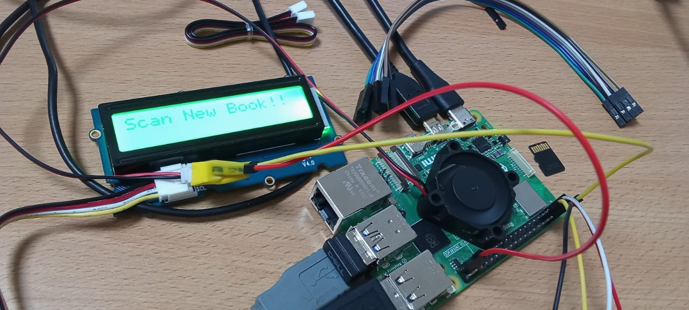

# Book Kiosk
This projects sets up a Book Exchange Kiosk on a Raspberry Pi using a barcode scanner, Google APIs, and Firebase. It allows users to scan books 
and automatically retrieve information about them, storing the data locally on the Raspberry Pi.




## Features

- Retrieve book titles using ISBNs.
- Save book title and timestamp information to a firebase db
- Continuously prompt for new ISBNs until manually stopped.

## Requirements

- Python 3.x
- `requests` library (install using `pip install requests`)

## Setup

1. **Clone the repository or download the script.**

2. **Install required packages:**
   Make sure you have the `requests` library installed. You can install it using pip:
   ```bash
   pip install requests
   pip install firebase-admin
